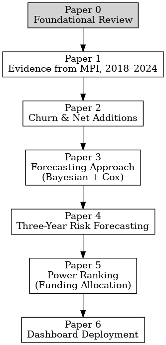

# Preface to the Series

This series of seven papers develops and applies an **AI-assisted portfolio triage framework** for Canada’s Major Projects Inventory (MPI). The framework combines Bayesian likelihood-ratio scorecards and Cox proportional hazards models, extending them through hybrid AI methods, portfolio applications, and deployment in a decision-support dashboard.

To orient readers, the series begins with **Paper 0**, a **Foundational Review**. This paper surveys the relevant literature on Bayesian scorecards, Cox survival models, and hybrid approaches, while situating the work within Canada’s infrastructure crossroads of large-scale investment, regulatory uncertainty, Indigenous engagement, and decarbonization. By marking the literature review as Paper 0, the series provides a clear intellectual starting point while preserving the integrity of cross-references to Papers 1 through 6.

The sequence of contributions is as follows:

* **Paper 0 (Foundational Review):** Literature on AI-assisted portfolio triage, with Canadian policy and investment context.  
* **Paper 1:** Evidence from the MPI, 2018–2024.  
* **Paper 2:** Churn and Net Additions in Canada’s Major Project Pipeline.  
* **Paper 3:** A Transparent, Auditable Forecasting Approach using Bayesian and Cox models.  
* **Paper 4:** Three-Year Risk Forecasting at the portfolio level.  
* **Paper 5:** Power Ranking for competitive funding allocation, with application to the Clean Fuels Fund.  
* **Paper 6:** Deployment of a Risk Engine Dashboard as a minimum viable product.  

Together, these seven papers form a coherent program of research. Paper 0 establishes the theoretical and policy foundations, while Papers 1 through 6 build empirically and methodologically, showing how AI-assisted triage can sharpen decision-making for developers, financiers, planners, and policymakers tasked with stewarding Canada’s major projects.

---

## Series Flowchart

The following diagram shows how the seven papers build on each other:

